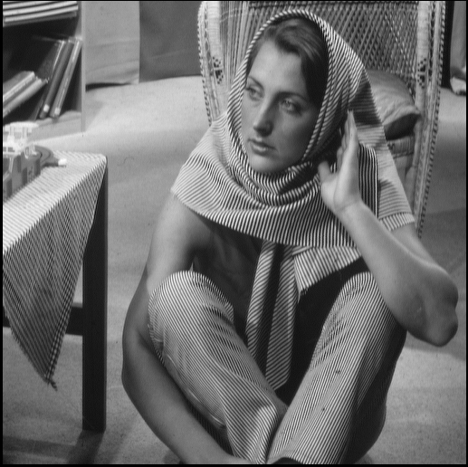
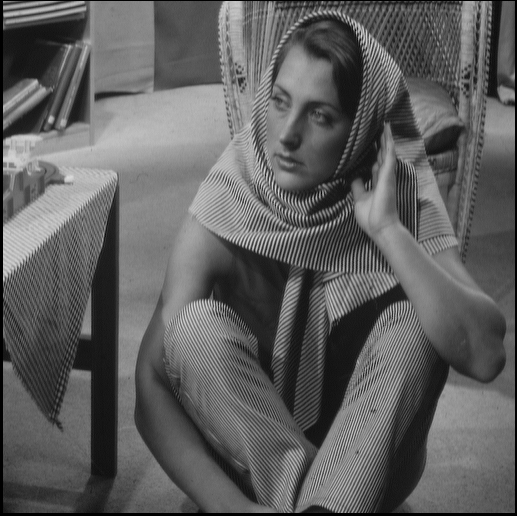
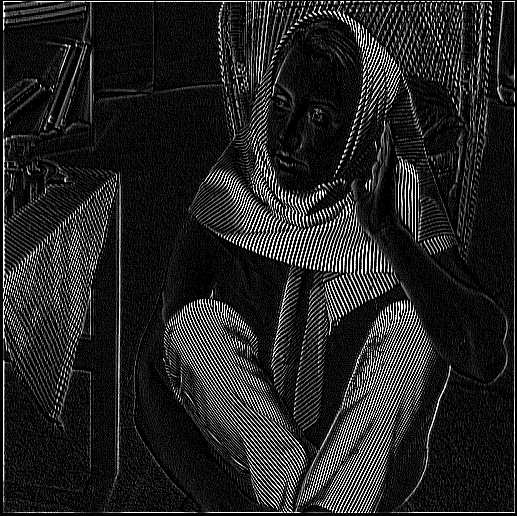
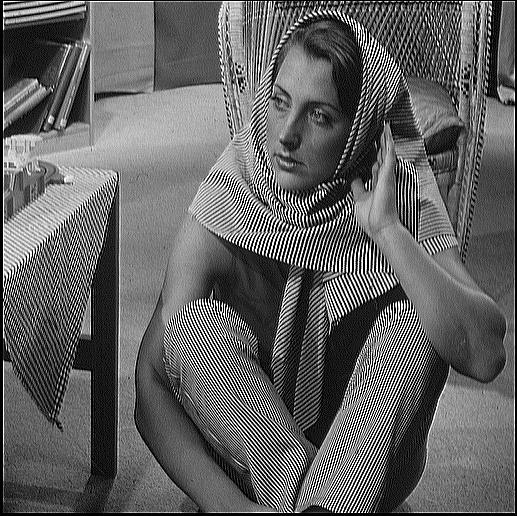

# 2 way symmetry
Utilizes the kernel's x and y-axis symmetrical properties to decrease the number of DSP computations per pixel. Uses RAM based shift register instead of two FIFOs for caching data for sliding window. The design is highly pipelined to increase maximum frequency. The results derived using a testbench are shown below.

  
*Figure 1: Original Image*

  
*Figure 2: Identity Image*

  
*Figure 3: Edge Image*

  
*Figure 4: Sharpened Image*
