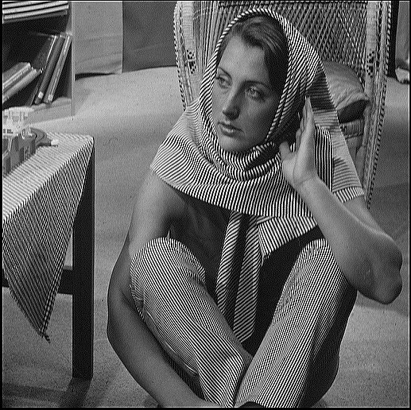

# Specific Coefficient
Applies a 3x3 sharpening kernel on a 512 x 512 image by utilizing the kernel's properties and compacting the kernel into one equation per pixel. Uses one RAM based shift register rather than two FIFOs for caching two line buffers to utilize memory efficiently. Pipelined across multiple stages to increase unrestricted Fmax. The design does not use a DSP and the only bottleneck in its replication is BRAM memory, making it more suitable for replication and a higher throughput. 

  
*Figure 1: Original Image*

  
*Figure 2: Sharpened Image*
